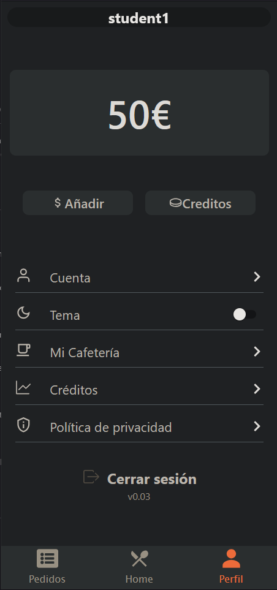
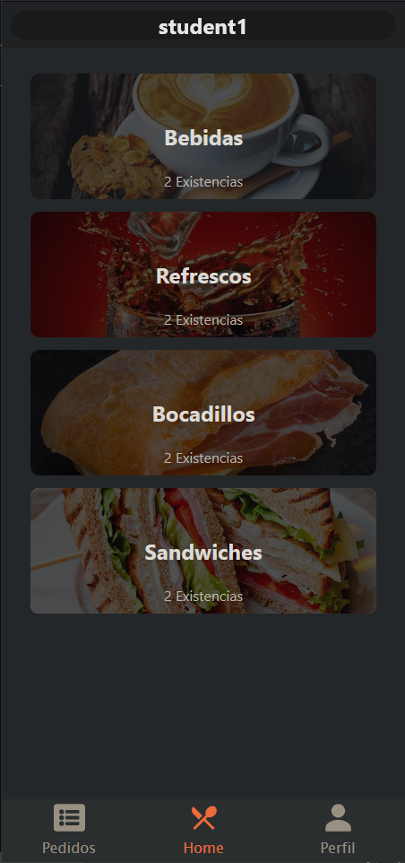
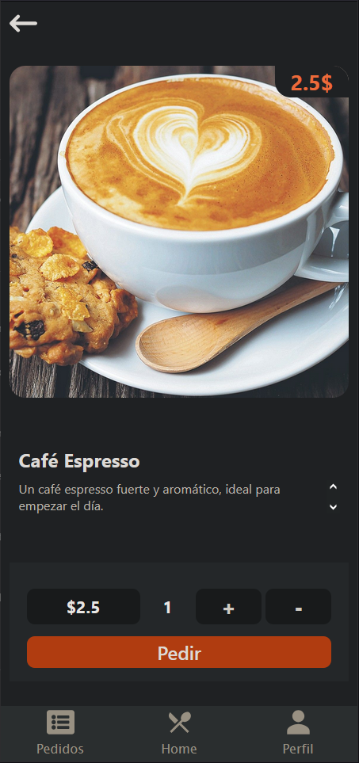

<div align="center">
    
    <br>
    <h1>School Coffe ApiResftul</h1>
</div>

<details>
    <summary>Details of contents</summary>
        <ol>
            <li><a href="#about-the-project">About the project</a><li>
        </ol>
</details>

This project aims to develop an application that allows multiple schools to create and manage their own cafeteria. The app will enable students to order the food they want, ensuring it is ready by the time their break starts.

<div align="center">
    
    
    
</div>

## Features 💫
- **Cafeteria Creation:**  
    Each school can register and set up their personalized cafeteria profile, including menus, operating hours, and payment methods.

- **Student Accounts:**  
    Students will have individual accounts to place orders, track their history, and make payments seamlessly.

- **Customizable Menus:**  
    Cafeterias can update and customize their menu based on daily availability and special offers.

- **Order Scheduling:**  
    Students can schedule their orders to be prepared and ready during break time, minimizing wait times.

- **Multi-School Support:**  
    The application will support multiple institutions, with separate profiles and settings for each school.

- **Admin Dashboard:**  
    Schools will have an admin dashboard to monitor cafeteria performance, manage orders, and analyze trends.

## Technologies 👨🏾‍💻

- **Backend**: MYSQL 

  
  
- **Frontend**: HTML5, CSS, JS

 
 
 

- **Database**: MySQL


- **ORM**: Sequelize (sql)


- **Dependencies**: Node Js


<p align="right" id="#about-the-project">hey</p>


## Installation ⚙️

1. Clone the repository:
    ```bash
    git clone https://github.com/IsaacRamosDaw/The_Cafeteria.git
    cd TheCafeteria
    ```

2. Install npm dependencies:
    ```bash
    npm install (Frontend)
    npm install (Backend)
    ```

3. Start the engine:
    ```bash
    node index (backend)
    npm run dev (frontend)
    ```
4. Test with database seeds
   ```bash
    npx sequelize-cli db:seed:all 
   ```

## Usage 🕹️

1. **Welcome**:
   - Where you can create your account as a student or log in directly as a student, worker, or administrator.
2. **Admin dashboard**:
   - Provides administrators with tools to manage cafeteria settings, track daily operations, oversee orders, and analyze performance reports.
3. **Home**:
   - Displays a summary of cafeteria operations, including active orders, announcements, and quick access to user-specific features.
4. **Student menu**:
   - Allows students to browse the available food items, customize their orders, view pricing, and schedule their meals for pick-up during break times.
5. **Worker dashboard menu**:
   - Enables cafeteria workers to view incoming orders, update order statuses (e.g., in preparation, ready, delivered), and manage inventory.
6. **Profile**:
   - Lets users edit their personal details, change their password, and update preferences such as notification settings or favorite meals.
7. **Orders**:
   - Displays a detailed history of placed orders for students and allows them to track the status of active orders in real-time. Administrators and workers can use this section to manage and monitor order flow.

## Authors ✒️

- [**Mansour**](https://github.com/mansulol)
- [**Cynthia**](https://github.com/Cynthia300)
- [**Isaac**](https://github.com/IsaacRamosDaw)

## Thanks 🎁
- Thanks to my teacher [Tiburcio](https://github.com/tcrurav) for this experience
- Thanks to [Villanuevand](https://github.com/Villanuevand) for the template of this readme
- Thanks to all my classmate and partners in this prject group

---
⌨️ with ❤️ the best group of DAW2ºT
